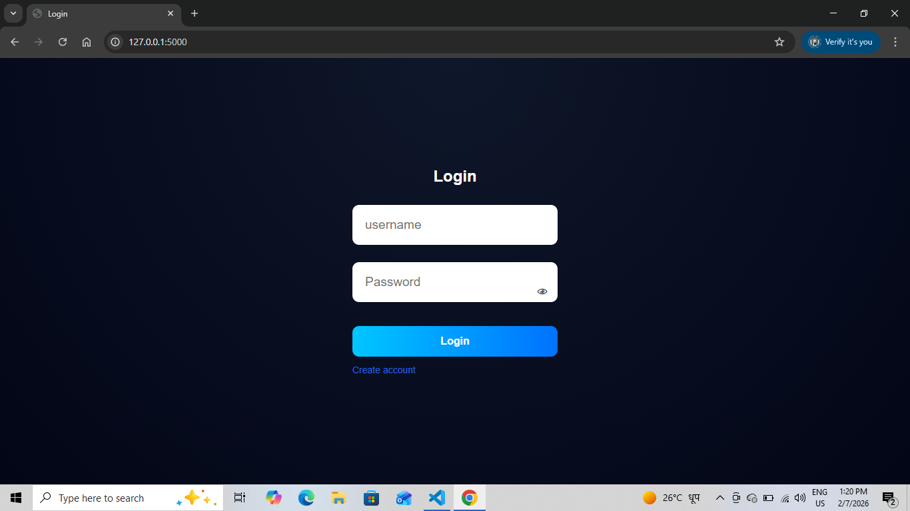
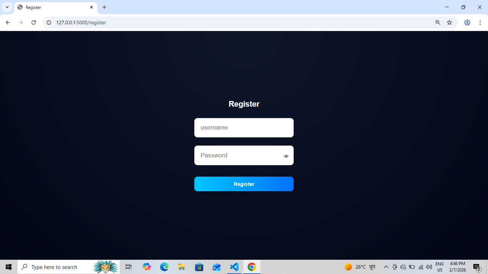
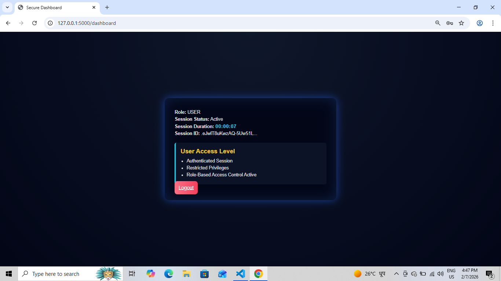
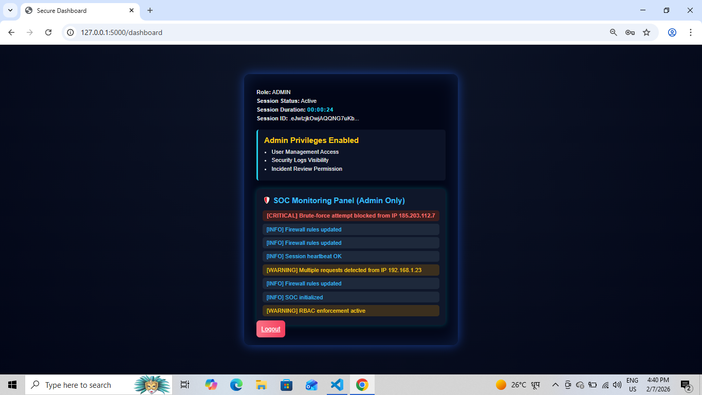

# Secure Web Application – Cyber Security Internship Project

This project is a Secure Web Application built using Flask as part of the  
**Cyber Security & Ethical Hacking Internship at Cryptonic Area**.

## Features
- User Registration & Login
- Role-Based Access Control (Admin / User)
- Secure Password Hashing
- Protected Routes using Authentication Middleware
- Session Handling & Authorization Checks

## Security Implementation
- Passwords are hashed before storage
- Input validation to prevent basic attacks
- Role-based authorization for admin routes
- Secure session handling using Flask

## Tech Stack
- Backend: Python (Flask)
- Frontend: HTML, CSS
- Database: SQLite

## Project Structure
secure-web-app/
├── app.py
├── database/
├── middleware/
├── security/
├── templates/
├── static/
├── screenshots/
└── README.md

## Screenshots

### Login Page

### Register Page

### User Dashboard

### Admin Panel

## Learning Outcome
This project helped me understand:
- Secure authentication flow
- Role-based access control
- Defensive security mindset in web applications

## Internship
**Organizer:** Cryptonic Area  
**Domain:** Cyber Security & Ethical Hacking
